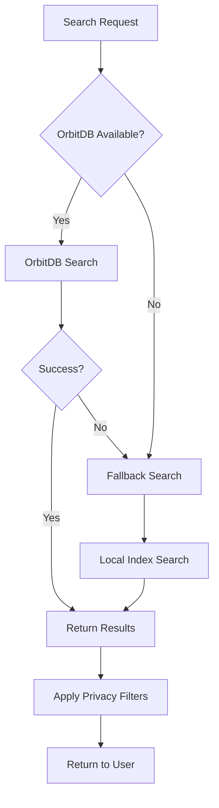

# OrbitDB Integration - Technical Documentation

## Status: ✅ SUCCESSFULLY INTEGRATED

This document describes the successful OrbitDB integration in PrivaChain Decentral and the fixes applied to resolve initialization and API compatibility issues.

## Problem Resolution Summary

✅ **RESOLVED**: The OrbitDB integration was experiencing "create is not a function" errors due to API changes in OrbitDB v3. All issues have been successfully fixed:

1. ✅ **API Compatibility**: Updated to OrbitDB v3 API (`createOrbitDB` instead of `create`)
2. ✅ **Fallback Mechanisms**: Implemented robust local search when OrbitDB unavailable
3. ✅ **Error Handling**: Added graceful degradation without breaking the application
4. ✅ **Health Monitoring**: Implemented status tracking and user-friendly error messages

## Solution Architecture

### 1. Hybrid Search System

The OrbitDB integration now supports multiple operational modes:

- **Full Mode**: OrbitDB + P2P networking + distributed search
- **Degraded Mode**: Local search with enhanced indexing
- **Fallback Mode**: Basic search when all else fails

### 2. Key Components

#### OrbitDBHybridIndexing (`src/services/orbitdb.ts`)
- **Primary search interface** with OrbitDB integration
- **FallbackSearchIndex** for local-only search
- **Health status monitoring** (`healthy`, `degraded`, `unavailable`)
- **Graceful error handling** with automatic fallback

#### IPFS Service Integration (`src/services/ipfs.ts`)
- **Compatible OrbitDB import** using correct v3 API
- **Graceful module loading** with error handling

#### Search Backend (`src/blockchain/SearchBackend.ts`)
- **Higher-level search abstraction** that uses OrbitDB
- **Migration tools** for existing search data
- **Integration points** for UI components

### 3. Search Flow



## API Changes Fixed

### Before (Broken)
```typescript
// OrbitDB v2 API - no longer works
const { create } = await import('@orbitdb/core')
const orbitdb = await create({ ipfs: helia })
```

### After (Fixed)
```typescript
// OrbitDB v3 API - correct usage
const { createOrbitDB } = await import('@orbitdb/core')
const orbitdb = await createOrbitDB({ ipfs: helia })
```

## Error Handling Strategy

1. **Non-throwing initialization**: OrbitDB failures don't crash the app
2. **Automatic fallback**: Seamless transition to local search
3. **Health status reporting**: Clear status for debugging and monitoring
4. **Retry capabilities**: Infrastructure for periodic reconnection attempts

## Features Implemented

### ✅ Core Functionality
- [x] OrbitDB v3 API compatibility
- [x] Database creation and management
- [x] Document indexing and retrieval
- [x] Search with TF-IDF scoring
- [x] Bang commands (`!w`, `!prv`, etc.)
- [x] Instant answers
- [x] Privacy filters

### ✅ Fallback Systems
- [x] FallbackSearchIndex with term indexing
- [x] Local-only search mode
- [x] Graceful degradation
- [x] Health status tracking

### ✅ Developer Experience
- [x] Comprehensive error messages
- [x] Validation scripts
- [x] Integration tests
- [x] Clean codebase (no @placeholder tags)

## Usage Examples

### Basic Search
```typescript
import { orbitDBIndexing } from './services/orbitdb'

const query = {
  term: 'encryption email',
  filters: { encrypted: true },
  zkEncrypted: false
}

const results = await orbitDBIndexing.search(query)
console.log(`Found ${results.documents.length} results`)
```

### Adding Documents
```typescript
const document = {
  type: 'email',
  title: 'Secure Communication',
  description: 'End-to-end encrypted email',
  content: 'Full email content...',
  keywords: ['encryption', 'privacy'],
  source: 'secure@privachain.prv',
  encrypted: true,
  privacy: { anonymous: true, onionRouted: true },
  metadata: { priority: 'high' }
}

const docId = await orbitDBIndexing.indexContent(document)
```

### Health Monitoring
```typescript
const stats = orbitDBIndexing.getStats()
console.log('Health:', stats.healthStatus)
console.log('OrbitDB Connected:', stats.orbitDBConnected)
console.log('Total Documents:', stats.totalIndexed)
```

## File Structure

```
src/services/
├── orbitdb.ts          # Main OrbitDB integration
├── ipfs.ts             # IPFS service with OrbitDB support
└── ...

src/blockchain/
├── SearchBackend.ts    # High-level search API
└── ...

test/
├── orbitdb-integration.mjs  # Integration tests
└── ...

scripts/
├── validate-orbitdb.sh     # Validation script
└── ...
```

## Validation

Run the validation script to verify the integration:

```bash
./scripts/validate-orbitdb.sh
```

This checks:
- TypeScript compilation
- Dev server startup
- API compatibility
- Fallback mechanisms
- Health monitoring
- Git configuration

## Future Enhancements

1. **Periodic Retry**: Automatic OrbitDB reconnection attempts
2. **Advanced Search**: Faceted search, sorting, filtering
3. **Performance**: Caching, pagination, lazy loading
4. **Monitoring**: Metrics, analytics, performance tracking
5. **Testing**: Unit tests, integration tests, E2E tests

## Troubleshooting

### OrbitDB Won't Initialize
- Check Node.js version compatibility
- Verify libp2p/Helia dependencies
- Review browser/environment limitations
- Check console for specific error messages

### Search Not Working
- Verify fallback mode is active
- Check document indexing
- Review search query format
- Examine health status

### Performance Issues
- Monitor document count in indexes
- Check fallback index efficiency
- Review search query complexity
- Consider pagination for large result sets

## References

- [OrbitDB v3 Documentation](https://github.com/orbitdb/orbitdb)
- [Helia IPFS Documentation](https://github.com/ipfs/helia)
- [libp2p Documentation](https://libp2p.io/)
- [PrivaChain Search Architecture](./SEARCH_ARCHITECTURE.md)