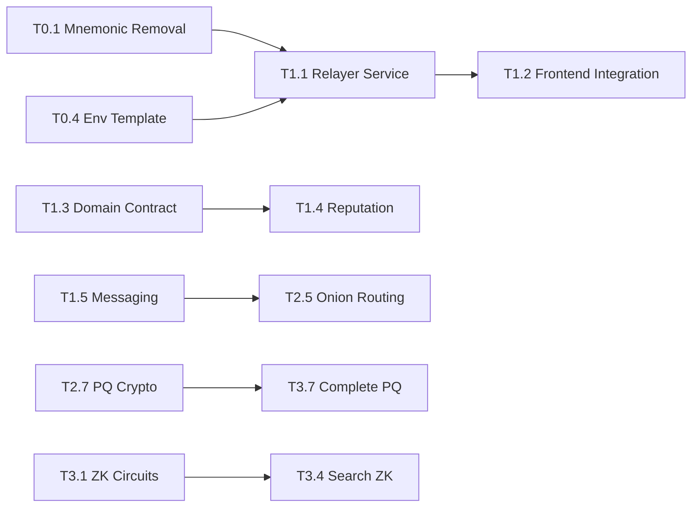

# PrivaChain Development Task Index

**Document Version**: 1.0  
**Last Updated**: 2024-12-19  
**Current Phase**: Phase 0 (Stabilization)

## Overview

This document provides central navigation for the PrivaChain development process, implementing the [Delivery Runbook execution](../README.md) for transforming the current repository into a fully described anonymous Web3 privacy platform.

## 📋 Phase 0 - HARDEN & CLARIFY (Weeks 1-2)

**Focus**: Remove misleading placeholders, secure secrets, add visibility & documentation skeleton.

### Completed Tasks ✅

- [x] **T0.1** (★) Remove hardcoded mnemonic from client bundle
  - **Status**: ✅ COMPLETED
  - **Branch**: `feature/remove-mnemonic`
  - **Files Changed**: 8 files (frontend security hardened)
  - **Result**: No mnemonic phrases in `src/` directory, backend relayer service implemented

- [x] **T0.2** Add Documentation Skeleton
  - **Status**: ✅ COMPLETED
  - **Branch**: `docs/base-architecture`
  - **Files Created**: 4 documentation files
  - **Result**: Comprehensive status tracking and architecture overview

- [x] **T0.3** Mark Placeholder Crypto & ZK Clearly
  - **Status**: ✅ COMPLETED
  - **Branch**: `chore/mark-placeholders`
  - **Files Changed**: 5 files with security annotations
  - **Result**: All placeholder functions marked with `@placeholder @insecure`

- [x] **T0.4** Introduce .env.template & Git Ignore Harden
  - **Status**: ✅ COMPLETED
  - **Branch**: `infra/env-template`
  - **Files Created**: `.env.template`, `scripts/precommit/secret-scan.cjs`
  - **Result**: Secret scanning automation and environment hardening

- [x] **T0.5** (★) Security Scan Pipeline Bootstrap
  - **Status**: ✅ COMPLETED
  - **Branch**: `ci/pipeline-bootstrap`
  - **Files Changed**: `.github/workflows/ci.yml`
  - **Result**: Security-first CI/CD pipeline with npm audit and Semgrep

- [x] **T0.6** Create Task Index (This File)
  - **Status**: ✅ COMPLETED
  - **Branch**: `docs/task-index`
  - **Files Created**: `docs/TASK_INDEX.md`
  - **Result**: Central navigation and progress tracking

### Phase 0 Summary

**🎯 Phase 0 Objectives**: ACHIEVED  
**📊 Completion**: 6/6 tasks (100%)  
**🔒 Security Status**: Hardened (no production secrets in frontend)  
**📚 Documentation**: Complete baseline established  
**🏗️ Infrastructure**: Security scanning and CI/CD operational

## 📅 Upcoming Phases

### Phase 1 - CORE PRIVACY & MESSAGING FOUNDATION (Weeks 3-6)

**Focus**: Deliver secure messaging protocol skeleton, basic contracts, relayer service.

#### Planned Tasks

- [ ] **T1.1** Implement Gas Relayer Service (Core)
  - **Goal**: Separate backend service for gas-sponsored transactions
  - **Dependencies**: T0.1, T0.4
  - **Deliverables**: Fastify server with `/tx/execute` endpoint

- [ ] **T1.2** Frontend Integration with Relayer
  - **Goal**: Replace direct contract calls with relayer API
  - **Dependencies**: T1.1
  - **Deliverables**: `src/api/relayerClient.ts` integration

- [ ] **T1.3** DomainRegistry CosmWasm Contract (MVP)
  - **Goal**: On-chain anchor for domain registrations
  - **Dependencies**: T0.* baseline
  - **Deliverables**: Rust contract with register/query operations

- [ ] **T1.4** Reputation Contract (Basic)
  - **Goal**: Track domain or relay reputation
  - **Dependencies**: T1.3
  - **Deliverables**: Update/slash/query reputation functions

- [ ] **T1.5** Messaging Protocol Skeleton (Double Ratchet/MLS Choice)
  - **Goal**: Implement minimal messaging cryptographic state
  - **Dependencies**: T0.3, T0.4
  - **Deliverables**: Session manager and encrypted message exchange

- [ ] **T1.6** Messaging Backend Store & Forward (Optional)
  - **Goal**: Server retains encrypted undelivered messages
  - **Dependencies**: T1.5
  - **Deliverables**: SQLite-backed message storage service

- [ ] **T1.7** IPFS Multi-Provider Integration (Step 1)
  - **Goal**: Abstract IPFS operations to provider strategy
  - **Dependencies**: T0.3
  - **Deliverables**: Modular IPFS client with Filebase integration

- [ ] **T1.8** Update docs/status.md after Phase 1
  - **Goal**: Keep status honest
  - **Dependencies**: End of Phase 1
  - **Deliverables**: Updated feature matrix

### Phase 2 - SEARCH, ONION ROUTING, VIDEO BASE (Weeks 7-12)

#### Key Tasks Preview

- **T2.1-T2.4**: Search infrastructure (crawler, indexer, frontend integration)
- **T2.5**: Onion routing layer prototype
- **T2.6**: Video signaling service + TURN config
- **T2.7**: Replace placeholder PQ crypto (Kyber integration)

### Phase 3 - ZK & HARDENED MEDIA (Weeks 13-20)

#### Key Tasks Preview

- **T3.1-T3.4**: Real ZK circuits (domain ownership, search inclusion)
- **T3.5**: Media insertable streams encryption
- **T3.6**: Mixnet (Nym) integration
- **T3.7**: Complete PQ crypto replacement

### Phase 4 - PRODUCTION HARDENING (Weeks 21-24)

#### Key Tasks Preview

- **T4.1**: Observability stack integration
- **T4.2**: Traffic padding & dummy packets
- **T4.3**: Rate & abuse controls
- **T4.4**: Security audit preparation
- **T4.5**: End-to-end test suite
- **T4.6**: Final documentation pass

## 📊 Progress Tracking

### Development Metrics

| Metric | Phase 0 | Phase 1 | Phase 2 | Phase 3 | Phase 4 |
|--------|---------|---------|---------|---------|---------|
| **Tasks Completed** | 6/6 (100%) | 0/8 (0%) | 0/8 (0%) | 0/8 (0%) | 0/6 (0%) |
| **Security Score** | Hardened | Planned | Planned | Planned | Production |
| **Documentation** | Complete | - | - | - | - |
| **Testing Coverage** | Basic | - | - | - | Comprehensive |

### Critical Path Dependencies

## 🔗 Documentation Links

### Core Documentation
- **[README.md](../README.md)**: Project overview and quick start
- **[Status Matrix](status.md)**: Detailed feature implementation status
- **[Claims & Limitations](claims_and_limitations.md)**: Security disclaimers and use cases
- **[Architecture Overview](architecture/overview.md)**: System design with Mermaid diagrams

### Security Documentation
- **[Security Placeholders](security/placeholders.md)**: Inventory of placeholder functions with replacement plans
- **[Secret Scanning](../scripts/precommit/secret-scan.cjs)**: Automated mnemonic detection
- **[Environment Template](../.env.template)**: Secure configuration management

### Development Resources
- **[Local Testing Guide](../LOCAL_TESTING.md)**: Comprehensive development setup
- **[CI/CD Pipeline](../.github/workflows/ci.yml)**: Security-first automation
- **[Contract Tests](../contracts/scripts/test.sh)**: Smart contract validation

## 🚀 Getting Started

### For New Contributors

1. **Read Documentation**: Start with [Claims & Limitations](claims_and_limitations.md)
2. **Check Current Status**: Review [Status Matrix](status.md)
3. **Understand Architecture**: Study [Architecture Overview](architecture/overview.md)
4. **Set Up Environment**: Follow [Local Testing Guide](../LOCAL_TESTING.md)
5. **Run Security Scan**: Execute `npm run scan:secrets`

### For Phase 1 Implementation

1. **Branch Strategy**: Create feature branches from main
2. **Security First**: All placeholder functions must remain marked
3. **Documentation**: Update status.md with each task completion
4. **Testing**: Maintain test coverage for all new functionality
5. **Review Process**: Security review required for crypto-related changes

## 🔄 Maintenance Schedule

### Weekly Updates
- [ ] **Monday**: Review GitHub Actions results
- [ ] **Wednesday**: Update status.md if needed
- [ ] **Friday**: Security scan review

### Phase Milestones
- **Phase 1 Kickoff**: Update this document with Phase 1 progress tracking
- **Phase 2 Kickoff**: Architecture review and performance baseline
- **Phase 3 Kickoff**: Security audit preparation
- **Phase 4 Kickoff**: Production readiness assessment

### Quarterly Reviews
- **Q1**: Phase 0-1 completion review
- **Q2**: Phase 2-3 security assessment
- **Q3**: Phase 4 production preparation
- **Q4**: Annual security and dependency audit

## 🆘 Support & Contact

### For Task-Specific Questions
- **Phase 0**: Documentation and security questions → GitHub Issues with `documentation` label
- **Phase 1**: Contract and relayer questions → GitHub Issues with `contracts` label
- **Phase 2**: Search and networking questions → GitHub Issues with `networking` label
- **Phase 3**: Cryptography questions → GitHub Issues with `cryptography` label
- **Phase 4**: Production readiness → GitHub Issues with `production` label

### Security Issues
- **Responsible Disclosure**: See [Claims & Limitations](claims_and_limitations.md#responsible-disclosure)
- **Security Questions**: GitHub Issues with `security` label
- **Urgent Security Issues**: Contact maintainers directly

### Development Issues
- **Build Problems**: Check [Local Testing Guide](../LOCAL_TESTING.md)
- **Test Failures**: Review CI/CD pipeline logs
- **Documentation Issues**: Open GitHub Issues with `docs` label

---

**📝 Document Maintenance**: This file is updated at each phase milestone. Contributors should update task completion status and add notes as development progresses.

**🔄 Next Update**: Phase 1 Kickoff (Target: Week 3)