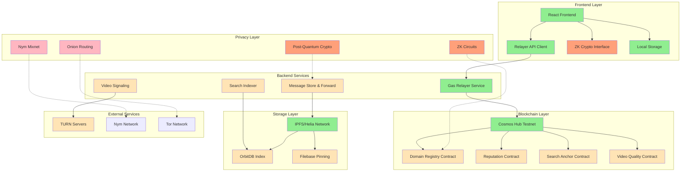
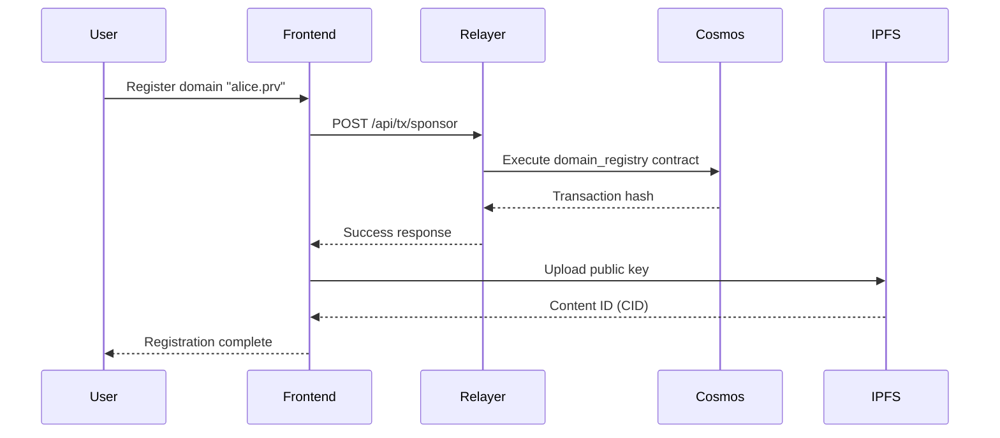
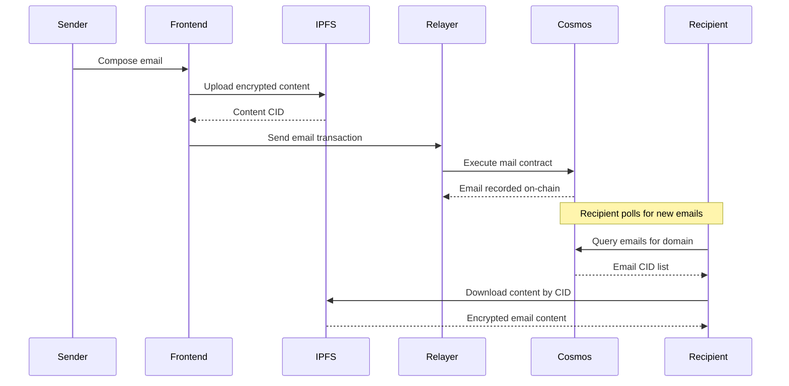
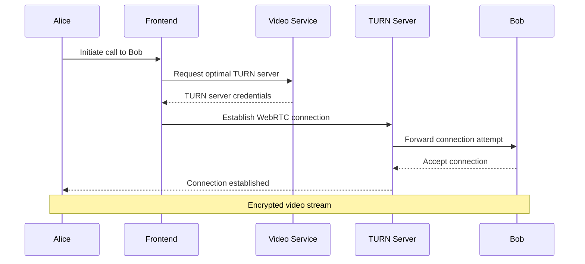

# Architecture Overview

**Version**: 1.0  
**Phase**: Phase 0 (Stabilization)  
**Last Updated**: 2024-12-19

> **Note:** This project uses the official Cosmos testnet/mainnet. The development team does NOT run or maintain validator nodes or a sovereign chain. All smart contracts are deployed to public Cosmos networks.

## System Architecture

PrivaChain Decentral is designed as a multi-layered privacy platform combining blockchain infrastructure, peer-to-peer networking, and cryptographic protocols.

## Component Status Legend

- 🟢 **Green (Implemented)**: Production-ready components
- 🟡 **Yellow (Partial)**: Basic implementation, needs enhancement
- 🟣 **Pink (Planned)**: Designed but not implemented
- 🟠 **Orange (Placeholder)**: Stub implementations - **@placeholder @insecure**

## Layer Descriptions

### Frontend Layer
- **React Frontend**: Modern web interface with TypeScript
- **Relayer API Client**: Secure interface to backend services
- **ZK Crypto Interface**: Cryptographic operations (currently placeholders)
- **Local Storage**: Encrypted local data persistence

### Backend Services
- **Gas Relayer Service**: Sponsors blockchain transactions for users
- **Message Store & Forward**: Handles offline message delivery
- **Search Indexer**: Crawls and indexes content for encrypted search
- **Video Signaling**: WebRTC connection establishment and quality optimization

### Blockchain Layer
- **Cosmos Hub Testnet**: Primary blockchain infrastructure (public network)
- **Domain Registry Contract**: .prv domain registration and management
- **Reputation Contract**: Trust scoring for network participants
- **Search Anchor Contract**: On-chain search index verification
- **Video Quality Contract**: TURN server management and incentives

**Note**: All contracts are deployed to public Cosmos networks. PrivaChain does not operate validator nodes or maintain a sovereign blockchain.

### Storage Layer
- **IPFS/Helia Network**: Decentralized content storage
- **OrbitDB Index**: Distributed database for search indexing
- **Filebase Pinning**: Reliable IPFS content pinning service

### Privacy Layer (Planned)
- **Onion Routing**: Multi-hop message routing for anonymity
- **Nym Mixnet**: Network-level metadata protection
- **ZK Circuits**: Zero-knowledge proof generation and verification
- **Post-Quantum Crypto**: Quantum-resistant encryption

### External Services
- **TURN Servers**: WebRTC relay infrastructure
- **Nym Network**: External mixnet for traffic anonymization
- **Tor Network**: Anonymous routing infrastructure

## Data Flow Patterns

### User Registration Flow

### Email Send Flow

### Video Call Flow

## Security Architecture

### Current Security Measures
1. **Mnemonic Isolation**: Developer keys isolated to backend services
2. **Content Encryption**: IPFS content encrypted before storage
3. **Gas Sponsorship**: Users don't handle private keys directly
4. **Environment Variables**: Secrets managed through configuration

### Planned Security Enhancements
1. **ZK Domain Proofs**: Prove domain ownership without revealing identity
2. **Onion Routing**: Multi-hop routing for traffic anonymization
3. **Mixnet Integration**: Network-level metadata protection
4. **Post-Quantum Encryption**: Quantum-resistant cryptographic algorithms
5. **Traffic Padding**: Timing and size correlation prevention

## Scalability Considerations

### Current Limitations
- **Single Relayer**: Central point of failure for gas sponsorship
- **IPFS Performance**: Content retrieval speed depends on network topology
- **Blockchain Throughput**: Limited by Cosmos Hub transaction capacity
- **Search Indexing**: Centralized crawler and indexer

### Scaling Solutions (Planned)
- **Multiple Relayers**: Federated gas sponsorship network
- **CDN Integration**: Content delivery acceleration
- **Sharded Contracts**: Horizontal scaling of smart contract state
- **Distributed Indexing**: Peer-to-peer search index distribution

## Integration Points

### External Dependencies
- **Cosmos SDK**: Blockchain infrastructure and consensus
- **IPFS Protocol**: Decentralized storage standard
- **WebRTC Standards**: Real-time communication protocols
- **Nym Mixnet**: Network anonymity infrastructure

### API Interfaces
- **Relayer API**: REST endpoints for sponsored transactions
- **IPFS API**: Content storage and retrieval operations
- **Contract ABI**: Smart contract interaction interfaces
- **WebRTC API**: Browser media streaming interfaces

## Development Phases

### Phase 0: Harden & Clarify (Current)
- Remove security placeholders
- Establish documentation
- Implement development infrastructure

### Phase 1: Core Privacy & Messaging Foundation
- Real messaging protocol implementation
- Contract deployment to testnet
- Basic reputation system

### Phase 2: Search, Onion Routing, Video Base
- Encrypted search implementation
- Multi-hop routing prototype
- E2E video encryption

### Phase 3: ZK & Hardened Media
- Real zk-SNARK circuits
- Post-quantum cryptography
- Production-grade media encryption

### Phase 4: Production Hardening & Observability
- Security audit and penetration testing
- Performance optimization
- Monitoring and alerting infrastructure

---

**Note**: This architecture document will be updated at each phase completion to reflect the current implementation status and planned enhancements.